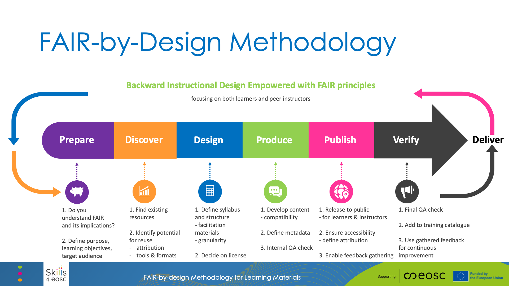

# FAIR-by-Design Methodology

The FAIR-by-Design Methodology for developing learning materials has been introduced by Skills4EOSC aiming to provide a comprehensive way of developing FAIR learning materials where the necessary FAIR elements are embedded in the materials design process. In this way the methodology guarantees that the produced materials will be FAIR not just from the point of view of the learners, but also other designers and trainers that would like to reuse and adapt the materials for their own purposes.

## [Download the slides in PPTX](https://github.com/FAIR-by-Design-Methodology/IDCC25workshop/raw/refs/heads/main/resources/03%20FAIR-by-Design/FAIR-by-Design_Methodology.pptx)

The premises embedded in the FAIR-by-Design methodology are transcending the fields of learning materials. Therefore, it is quite straightforward to adapt the methodology to produces other types of FAIR digital objects. In the frames of this workshop, we are considering how the FAIR-by-Design methodology can be adapted and used to create FAIR software objects.

The FAIR-by-Design Methodology is created around the popular backward instructional design process that is used to develop high-quality learner-centric materials. We have taken the steps of the backward instruction design process and added additional considerations to ensure that the process will be aimed towards the design of FAIR learning content from both the perspective of the learners and the perspective of the instructional designers and trainers.

## Methodology Stages

The methodology is broken down into a number of stages that are connected in a feedback loop thus enabling continuous improvement:

### Prepare

In the Prepare stage the instructional designers need to expand their skillset so that they can practically implement the FAIR principles. This means that in addition to the traditional instructional design skills, they should also be able to work with PIDs, repositories and catalogues, use a corresponding metadata schema, choose a license, and know how to acknowledge reused work with attribution.

One of the important tasks in this stage is to familiarize with the RDA minimal metadata schema for learning resources as this is the basis for the description of the FAIR learning materials.

This is the initial stage of the learning materials development process and thus it is important that in this stage the designer clearly defines the purpose of the learning materials, the target audience and the learning objectives while taking into consideration any prerequisites.

### Discover

Once the vision of what needs to be created is clear, the next step is to discover any existing learning materials that can be reused or simply serve as inspiration. For these purposes the designer needs to search different types of repositories that might host similar learning materials including OER repositories, learning platforms, general repositories and catalogues, as well as multimedia repositories that can provide sources of audio/visual props that are essential in multi-modal learning.

### Design

At this stage the designer has a clear idea of what is needed and what already exists. The next step is to sketch a conceptual map of the learning materials that will help crystalize the ideas and prepare the syllabus for the learning materials. The syllabus is then used as a high-level blueprint for the development of the learning materials.

In the design stage the overall structure of the learning materials is defined identifying all modules and learning units necessary together with the information on what can be reused and what needs to be designed from scratch. Careful attention should be put on license compatibility during this work.

Upon completing the structure, each learning unit needs to be designed using a modeling technique such as the Hunter's model
The design stage should also take into account the need for development of a facilitation guide that explains in details how to prepare and put the training into practice, as well as a feedback form that should be used to gather feedback after the learning process has finished.

### Produce

When the design is complete, it is time to move to the produce stage and choose the tools and file formats necessary to develop all of the content. Care must be taken that the chosen file formats are open so that reusability is supported, and it is recommended that a collaborative, versioning system is used to keep track of all contributions and changes. It is important to consider both the editable files that can be reused by trainers and the final file formats intended for learners.
One of the most important aspects of the produce stage is accessibility of the developed learning materials. Accessibility standards should be followed so as to maximize the audience for the learning materials.

During this stage the designers must not forget to add the human-readable and machine-readable metadata in the developed content as well as to develop the content of all facilitation documents such as the guide, activities description, lesson plans, etc.

The final step in the produce stage is to perform an internal Quality Assessment that will check that all elements are present and that the content is adequate.

### Publish

A satisfactory completion of the internal QA leads to the publication steps. Before the actual publication, very important final touches need to be done including activities such as the definition of the content of accompanying files: license, readme, citation, code of conduct and alike.

Once all necessary elements are in place, the learning materials can be published to a selected repo. If GitHub was chosen as the repository in the Produce stage, then the automated bridge between GitHub and Zenodo can be used to create a Zenodo record and obtain a DOI PID for the learning materials. This records is primarily intended for reuse by other designers and trainers.
In addition, the complete learning environment should be setup in a learning platform where the final file formats will be provided to the learners.

### Verify

The final steps in the methodology is to perform another QA round, this time focusing on external QA. At this stage the overall level of FAIRness of the learning materials needs to be checked and external experts should be used to provide unbiased feedback regarding the quality of the produced materials.

This stage also focuses on setting up different mechanism for gathering feedback so that the learning materials can be further improved. In this way it fosters the co-creation process that empowers learners and other designers and trainers to actively participate in the development.

### Continuous Improvement

The gathered internal and external feedback should be used as input for the development of a new version of the learning materials.

Upon the identification of potential improvements that should be implemented, the development processes circles back to the first stage aiming to publish a new improved version of the learning materials.

## FAIR-by-Design Booklet

{ type=application/pdf style="min-height:50vh;width:100%" }

## Hands-on Activity

Instructions:
1.	Part 1: Hands-on Task-Based Design 
    - Work individually or in small groups on the assigned tasks. Be prepared to briefly share your work with the larger group if time allows.
    - [Use the preprepared template doc available here](https://drive.google.com/drive/folders/1jtLEUoQSC0JAyBBirxWslHj3_J91zBN5?usp=sharing). **Copy paste and rename with your nickname before you start working.**
2.	Part 2: Self-Review Quiz: 
    - Join the Particify room on your device using the provided link or QR code. Answer the quiz questions, reviewing the explanations provided after each question to reinforce your understanding of the concepts.
3.	Review and Discussion: 
    - If time allows, the facilitator can lead a brief discussion about the hands-on tasks, the quiz results, and any remaining questions participants have.

Expected Outcomes:

- Participants gain practical experience in designing key elements of an Open Access training module.
- Participants develop a deeper understanding of the FAIR principles and how they apply to Open Access.
- Participants learn how to properly attribute resources and consider reusability in their design.
- Participants understand the importance of verification and continuous improvement in the design process.
- The quiz provides immediate feedback and reinforces learning.

## Summary

Training is vital for the European Open Science Cloud (EOSC) to succeed as key EU Open Science research meta-infrastructure. It tackles the challenge of upskilling a large community of various stakeholders with the necessary competences to both build and use data and services. It is therefore important that the EOSC training community is able to efficiently collaborate ensuring the delivery of high-quality up-to-date trainings and learning opportunities. To help achieve this goal, Task 3 of Work Package 2 within the Skills4EOSC project has produced a methodology for developing FAIR-by-Design learning materials that will ensure maximum reusability of developed learning materials within the community and higher-quality materials.

## Suggested Reading

- [FAIR-by-Design Methodology](https://fair-by-design-methodology.github.io/FAIR-by-Design_Book/) 
- [FAIR-by-Design Booklet](https://zenodo.org/records/14711525)
- [Training of Trainers course on Skills4EOSC LMS](https://learning.skills4eosc.eu/course/view.php?id=19)
- [Full Training GitPages](https://fair-by-design-methodology.github.io/FAIR-by-Design_ToT/latest/)
- [FAIR-by-Design Microlearning](https://fair-by-design-methodology.github.io/microlearning/latest/)
- [FAIR-by-Design Templates repository](https://github.com/FAIR-by-Design-Methodology/templates)

